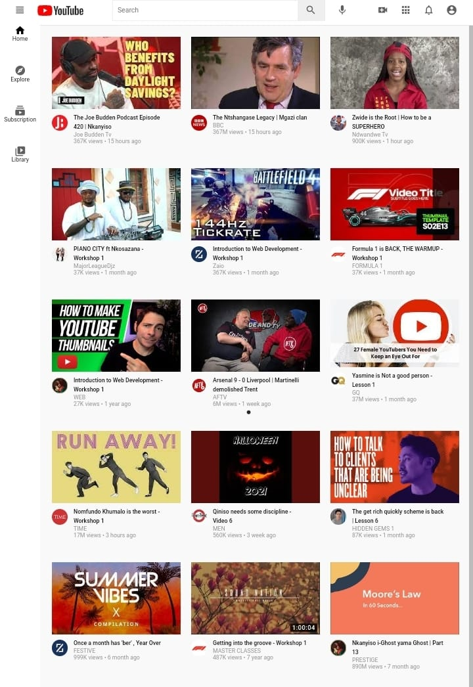

# Youtube Clone



> User Interface in Mobile responsiveness.

---

### Table of Contents

- [Description](#description)
- [How To Use](#how-to-view)
- [References](#references)
- [Author Info](#author-info)

---

## Description

This is my YouTube user interface clone , I used HTML and CSS to execute it. It is also mobile responsive. It demonstrates my skills in both languages mentioned above.

#### Languages Used

- HTML
- CSS

[Back To The Top](#youtube-clone)

---

## How To View

```html
<a href="https://youtube-nka-ui-clone.netlify.app/">Youtube Clone </a>
```

[Back To The Top](#youtube-clone)

---

## Developer Info

- Portfolio - [Nkanyiso's Portfolio](https://nkanyiso-portfolio.netlify.app/)

[Back To The Top](#youtube-clone)
